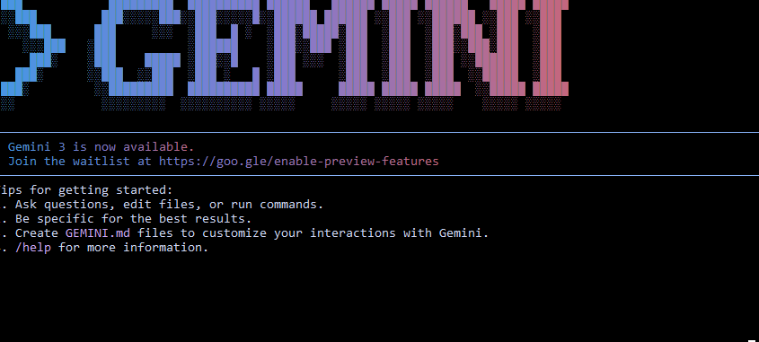

# 30days task 03 

🌟 PART A — Research Questions (Short Answers)
1. What new improvements were introduced in Gemini 3.0?
Gemini 3.0 offers significant improvements in reasoning, multimodal understanding, and agentic capabilities for complex tasks.

2. How does Gemini 3.0 improve coding & automation workflows?
Gemini 3.0 improves coding and automation by enabling agent-based workflows that can plan, generate, run, and verify code or shell commands end-to-end.

3. How does Gemini 3.0 improve multimodal understanding?
It has much more powerful multimodal capabilities meaning it can more effectively combine and reason over text, images, (and potentially other modalities).

4. Name any two developer tools introduced with Gemini 3.0.
Antigravity
Gemini CLI
🌟 PART B — Practical Task (Screenshot Required)
screenshot

